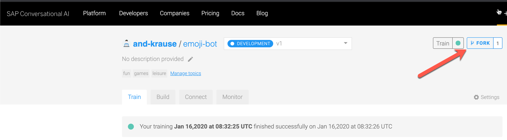
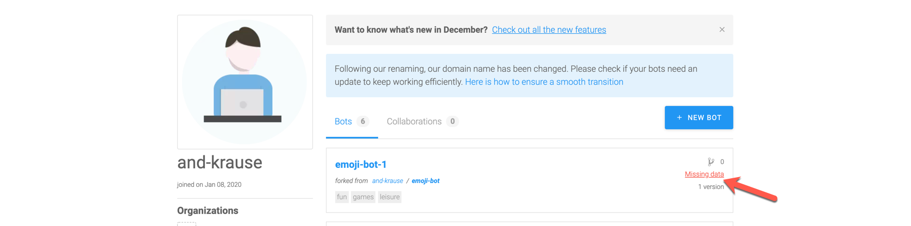
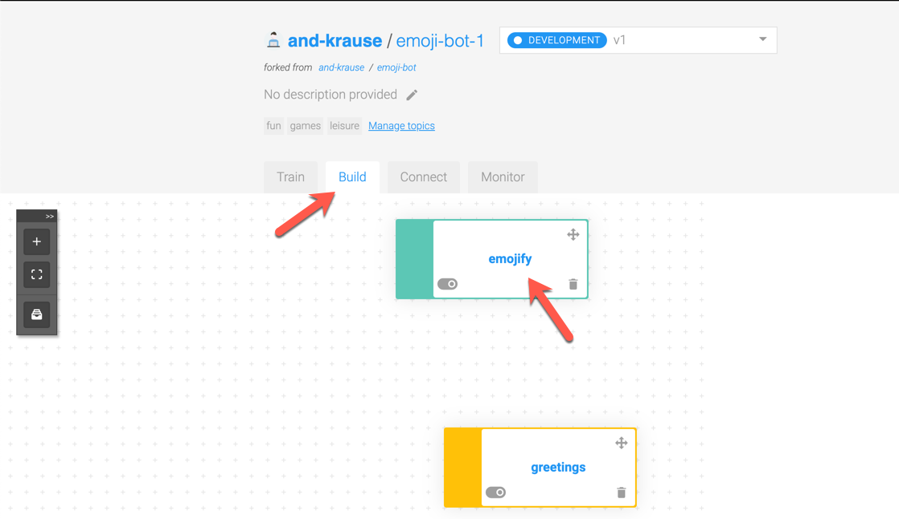
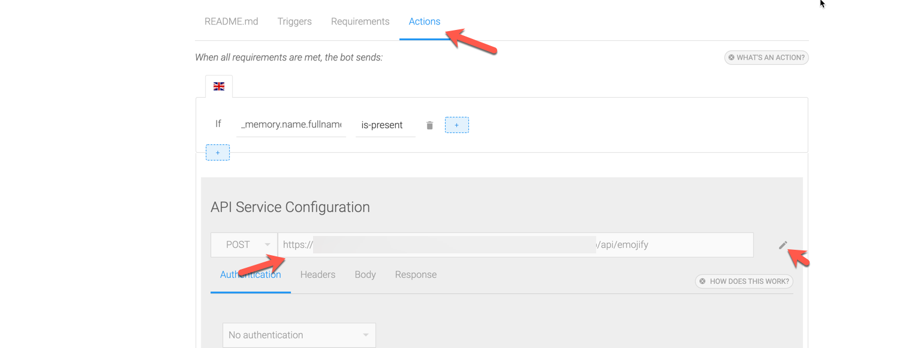
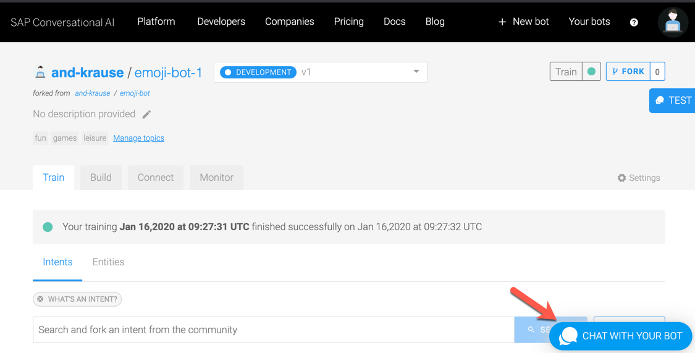
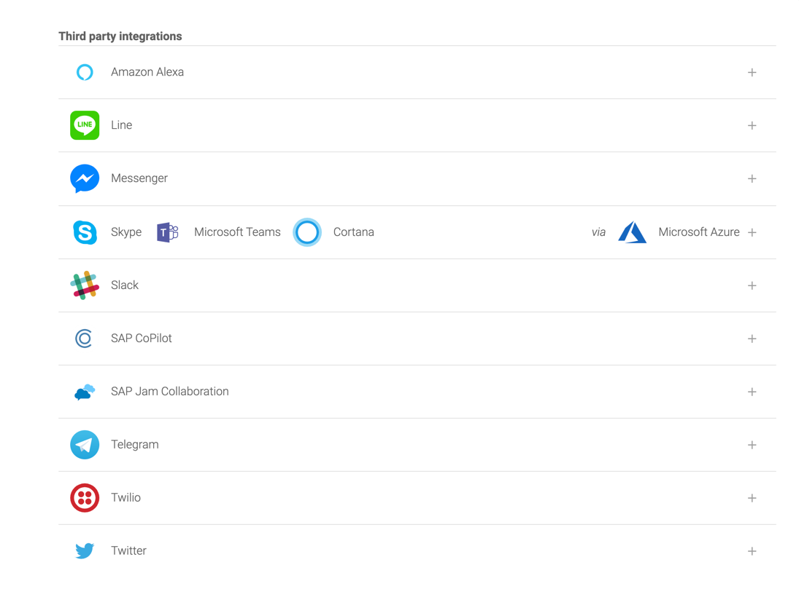

# Create a Chatbot

## Background

Traditional UIs require users to adapt to the machine. Nowadays so called [conversational uis](https://en.wikipedia.org/wiki/Conversational_user_interface) are changing this, so that humans can interact with machines as they do with other humans. 

[SAP Conversational UI](https://cai.tools.sap/) is a powerful platform to help you kickstart building new bots without being a professional machine learner. It also connects to popular messaging services and voice assistants like Slack, Alexa, Facebook and others. Hence you build your bot once and then use it in many different situations.

This sample bot leverages our backend and alows users to ask for their emoji.

## Learning Resources

[SAP Conversational UI](https://cai.tools.sap/) comes with many tutorials and resources already available. Hence there is no detailled description in this section. However here is a list of popular resources:

1. [Getting Started](https://cai.tools.sap/blog/build-your-first-bot-with-sap-conversational-ai/) shows you in simple steps how to build a simple Joke Bot and how to sign-up for an account
1. [Connect your Bot](https://cai.tools.sap/blog/nodejs-chatbot-movie-bot/) explains how to connect to additional data sources using a proprietary webhook format (haven't used this in the example)
1. [Connect your Bot Documentation](https://help.sap.com/viewer/a4522a393d2b4643812b7caadfe90c18/1912/en-US/31f328484e0f40f98d12a507e6f76f0c.html) explains how to connect to any API
1. [Memory Management](https://cai.tools.sap/blog/mastering-memory-management-bot-builder/) describes how you can manage the state of your conversation

## Details

The Chatbot built for the demo can be observed under https://cai.tools.sap/and-krause/emoji-bot. You can fork it and adapt it to your setup.

After Forking, you should manage the data privacy settings:

Then you go to `Build` and click on the `emojify` skill.

Under `Actions` you can change the API Service configuration and point to your backend. 

Now you can try it out anc chat with your bot:

## Connect your Bot

SAP Conversational AI comes with many connectivity options that let you connect to your favorite platforms. Details can be found in the [Blog](https://cai.tools.sap/blog/category/tutorial/) and the [Product Documentation](https://help.sap.com/viewer/a4522a393d2b4643812b7caadfe90c18/1912/en-US/7c96e0046b9346f488a08c8b1d2bb8b5.html)

 