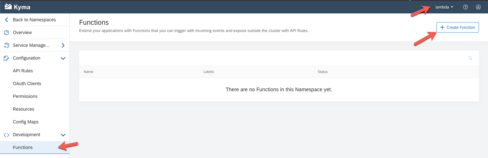
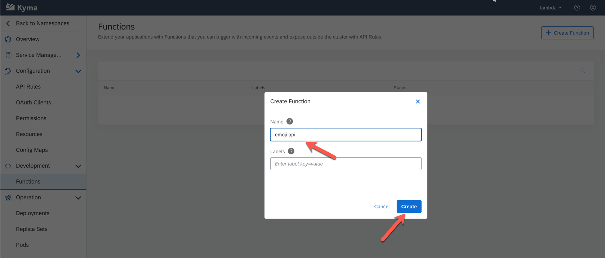
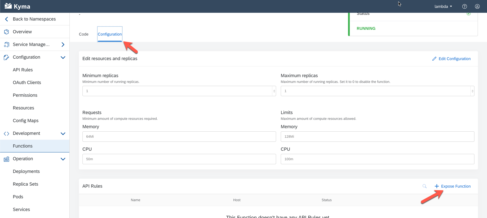
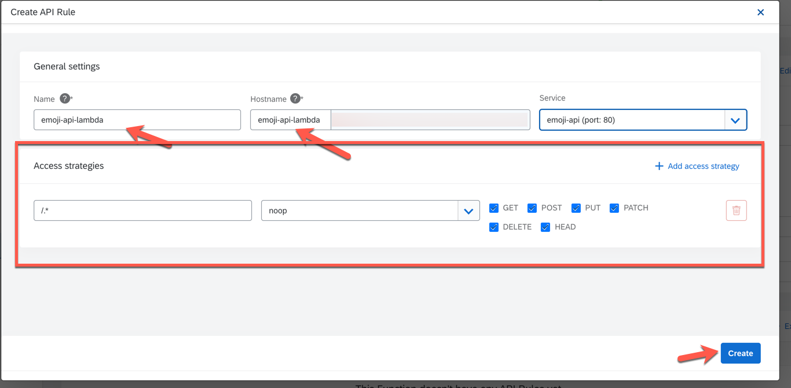
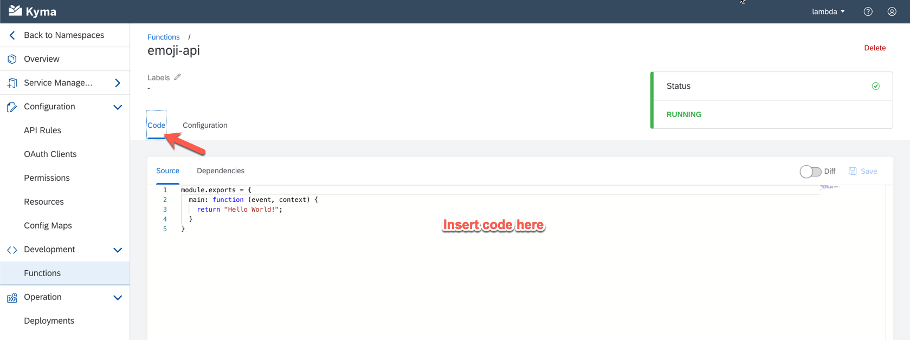
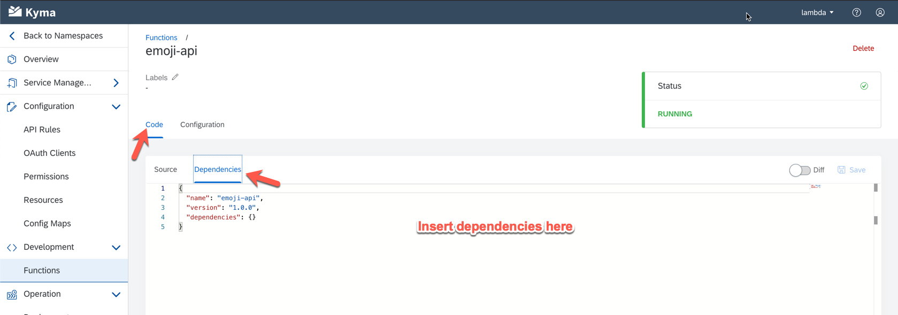
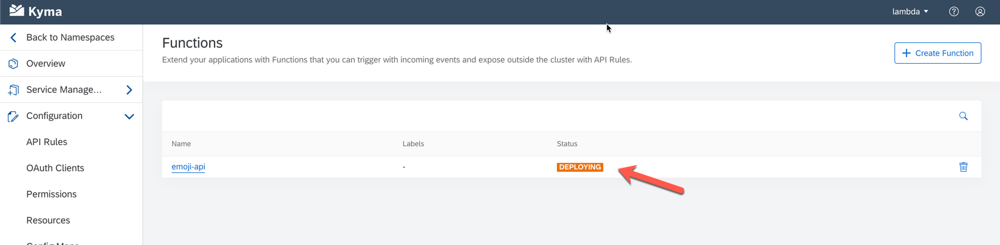
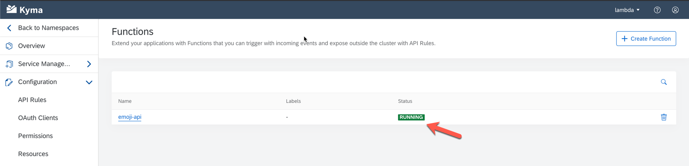
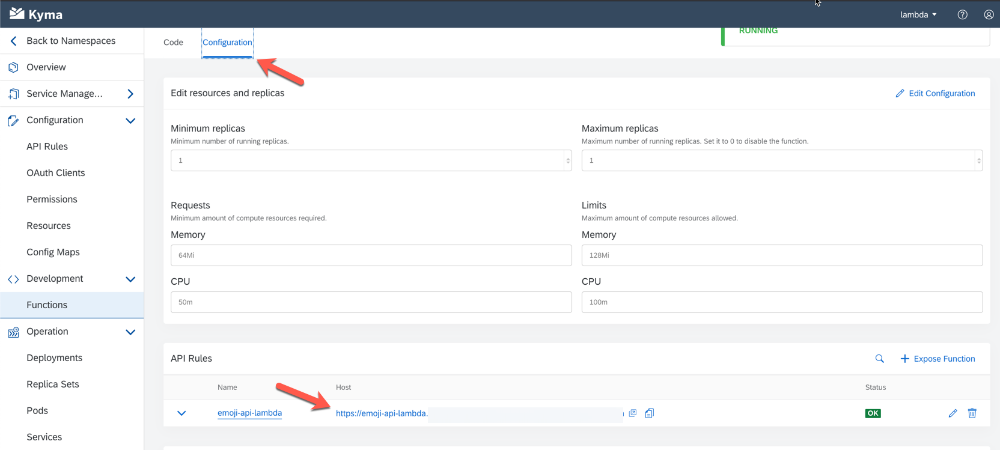

# Deploy API Backend to Kyma as a Lambda Function

Kyma simplyfies running simple node functions through its serverless [Lambda/Function as a Service](https://kyma-project.io/docs/components/serverless/) runtime. Here a developer can focus on writing the actual business level code and ignore all the boiler plate code for starting a http server, parsing the request, etc. Furthermore Kyma also takes over the packaging of code and fetching the depencies. Finally it also scales the function to meet the needs of the current load. 

Creating such a function is rater simple. In the UI (within your namespace), go to the `Development` section and click on `FUnctions`. Clicking the `Create Function` button lets you create a new function. 

Create the function with name `emoji-api`. and expose it via https as shown in the screenshots below:

Use the following values to expose without naming conflicts:

| Field         | Value           |
| ------------- |:-----------------------------------------:| 
| Service      | emoji-api      |
| Host / Name | `emoji-api-<namespace-name>` | 

Now you copy and paste the code provided in [lambda.js](lambda.js):

To manage the node dependencies, you have to activate `Dependencies` and copy and paste the contents of [package.json](package.json):

After saving the Function, the system will take some time to spin up a running instance. To determine the current status go back to the main screen and wait. It will eventually switch as shown below:

Then you can test the API through a REST client like postman. To retrieve the URL of the Function, go back to `Configuration` and see the url shown in the `API Rules` section. 

