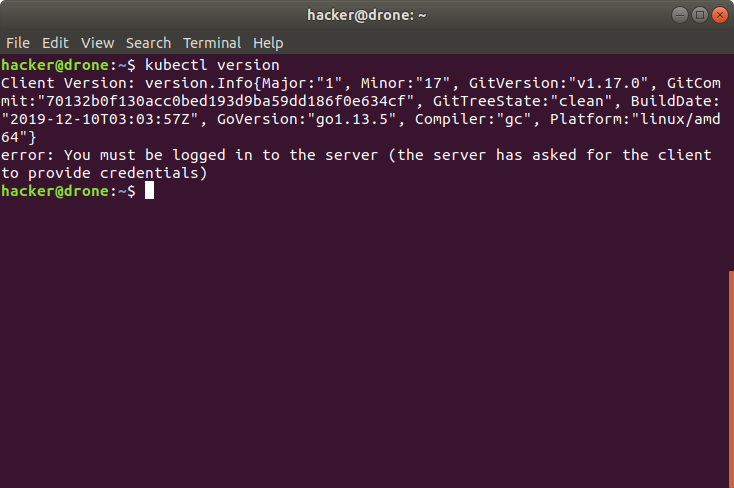
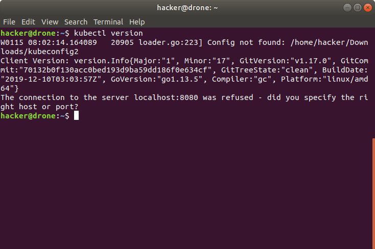
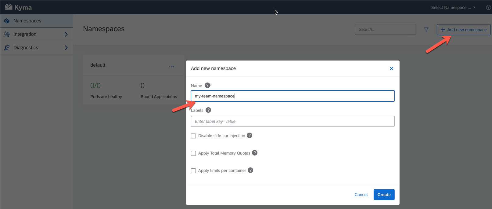
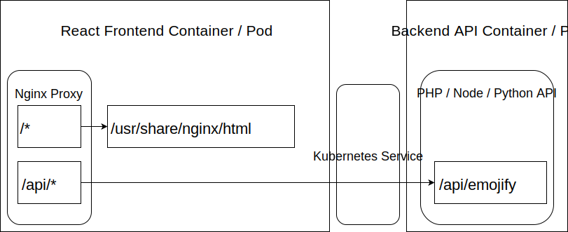

# Deploy To Kyma

## Create a Cluster

To deploy something to Kyma, you need to have access to it ;-). Kyma can either be installed as a open source project. This is described [here](https://kyma-project.io/docs/components/api-gateway). Or more conveniently it can be used as a service on SAP Cloud Platform. To use the service, follow steps 1 and 2 of the following SAP Help Article: https://help.sap.com/viewer/65de2977205c403bbc107264b8eccf4b/LATEST/en-US/d1abd18556f24fb091d081b2e3454b8b.html

## Download the Kubeconfig file

Kubernetes comes with a powerful api, which is often accessed via the [kubectl cli](https://kubernetes.io/docs/reference/kubectl/kubectl/). Kubectl is already installed on your virtual machines, so no need to do anything here. 

In order to access your Kubernetes environment, kubectl requires configuration often referred to as kubeconfig. Your Kyma Cluster comes with its own kubeconfig that you can download from the Kyma UI. To do so, follow the steps on the screenshot below:

A detailed description of how to do this is provided [here](https://kyma-project.io/docs/#tutorials-sample-service-deployment-on-a-cluster-get-the-kubeconfig-file-and-configure-the-cli).

### Troubleshooting

If you are not logged in you will get an error like the one below. If this is the case, then just download a new kubeconfig file from the ui and it should work again.

If your KUBECONFIG environment variable is not set correctly you will see something like on the screenshot below:

To analyze this further the following commands are helpful:

* Print the directory where the kubeconfig file should be located: `echo $KUBECONFIG`
* Read the file: `cat $KUBECONFIG`

## Use your Namespace

To support sharing of cluster resources, each team will work in its own Kubernetes [Namespace](https://kubernetes.io/docs/concepts/overview/working-with-objects/namespaces/). 

Namespaces can be created via the UI:

Or via the cli: `kubectl create namespace <insert-namespace-name-here>`

Issue the following command to default all actions via the cli to your team's namespace: `kubectl config set-context --current --namespace=<insert-namespace-name-here>`. This needs to be repeated whenever you download a new KUBECONFIG file.

### Troubleshooting

Should you observe any weird behaviour, issue the following command: `kubectl config get-contexts`. This will show the current default namespace assigned.

## The Scenario

In this scenario we are going to deploy two applications to Kyma. First of all a Backend that exposes a REST API. For this, there are sample implementations available in: 

* [PHP](../php)
* [Python](../python)
* [Java](../java) 
* Node.js
  * [Node.js Lambda/Function as a `Service](Lambda)
  * [Node.js Docker](../nodejs)

There will also be a [web frontend](../react) which is leveraging the API exposed to render emojis for a given name. This frontend is running behind an [nginx](https://hub.docker.com/_/nginx) "webserver". This webserver will serve the frontend and direct any api calls to the backend. The below graphic shows a conceptul view of that:

All except the lambda function require that a docker image is built and pushed as described [here](../docker/README.MD)

Details regarding creation and deployment of the containers are shared in the respective sections:

* [Backend API](api/)
* [Web Frontend](ui/)
