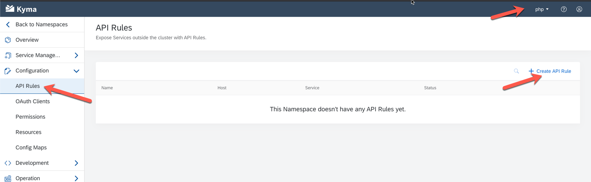
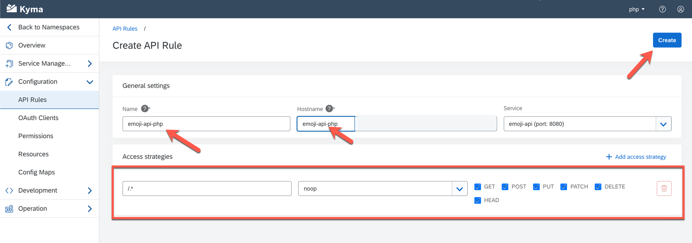
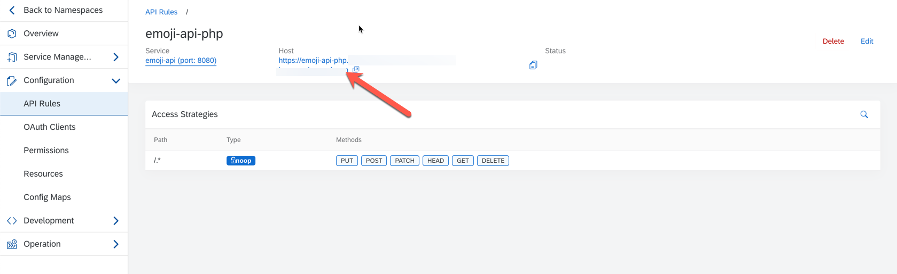

# Deploy React Frontend to Kyma

## Configuring the Nginx Proxy

Nginx comes with rich options for configuration. These are managed inside the [default.conf](default.conf) file. Our file is exposing two locations. One to serve the static content and one that redirects to the domain of the backend API [service](https://kubernetes.io/docs/concepts/services-networking/service/#dns). The configuration looks as follows:

```
server {
  listen 80;
  
  location / {
    root /usr/share/nginx/html;
    index index.html index.htm;
    try_files $uri $uri/ /index.html =404;
  }

  location /api {
    proxy_http_version 1.1;
    proxy_pass http://emoji-api/api;
  }

}
```

This sets up an http server listening on port 80. It exposes resources from directory `/usr/share/nginx/html` under the root and redirects any call to `/api` to our backend API which is hosted under the service emojo-api. To verify this, try calling `kubectl get svc emoji-api` if this does not return a result, return to the section on deploying the Backend API.

For further details refer to the [nginx product documentation](http://nginx.org/en/docs/)

## Pushing Configuration to Kyma

In Kyma/Kubernetes, configuration is managed in [ConfigMaps] (https://kubernetes.io/docs/tasks/configure-pod-container/configure-pod-configmap/) and [Secrets](https://kubernetes.io/docs/concepts/configuration/secret/). These can then be used to populate environment variables inside the running container or mounted into the file system (which we will do). Creating configmaps from files is quite simple by issuing the following command: `kubectl create cm nginx --from-file=default.conf`

Please verify the config map using the following command: `kubectl get cm nginx -o jsonpath={.data}`


## Create the Kubernetes Deployment 

A template for deploying the frontend is already provided as [deployment.yaml](deployment.yaml). It has all the basic constructs in place to deploy the Frontend. In order to deploy your application, all you need to do, is change the docker image referenced from `image: andy008/emoji-react:0.0.1` to your own and then issue the command:

`kubectl apply -f deployment.yaml`

Then wait for the deployment's [Pod](https://kubernetes.io/docs/concepts/workloads/pods/pod/) to be running. To check this, issue the following command: `kubectl get pods -w`

### Troubleshooting

Should you observe errors, you can use the describe command for the deployment (and the derrived pod) to get an idea about the error: `kubectl describe deployment emoji-ui`.


## Create the Kubernetes Service

To expose your UI as a service, just issue the following command: `kubectl apply -f service.yaml`

The yaml file does not require any editing.

## Expose the Kyma API

To expose your UI, navigate to the namespace that you created earlier, click on the `API Rules` menu item and then select `Create API Rule`:



Now you can select the service created earlier and expose it to the internet. This is illustrated below. 

To ensure no collisions exist, follow the below naming scheme:

| Field         | Value           |
| ------------- |:-----------------------------------------:| 
| Service      | emoji-ui      |
| Host / Name | `emoji-ui-<namespace-name>` |  




After saving you should see the same as below. To test the API, just click on the hightlighted link:


